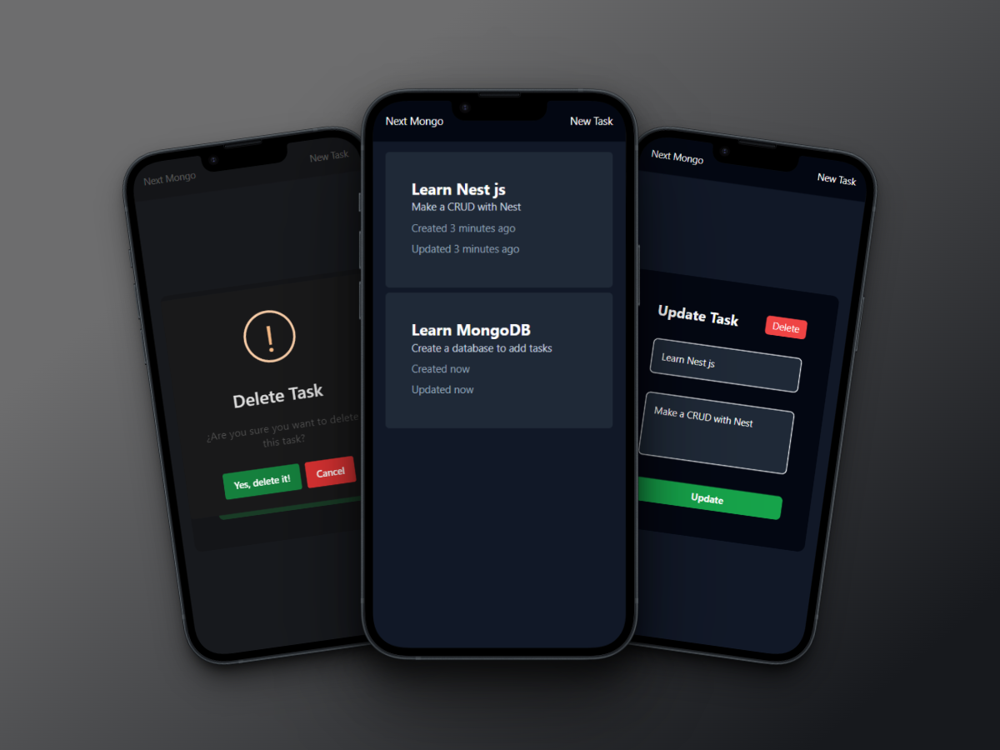
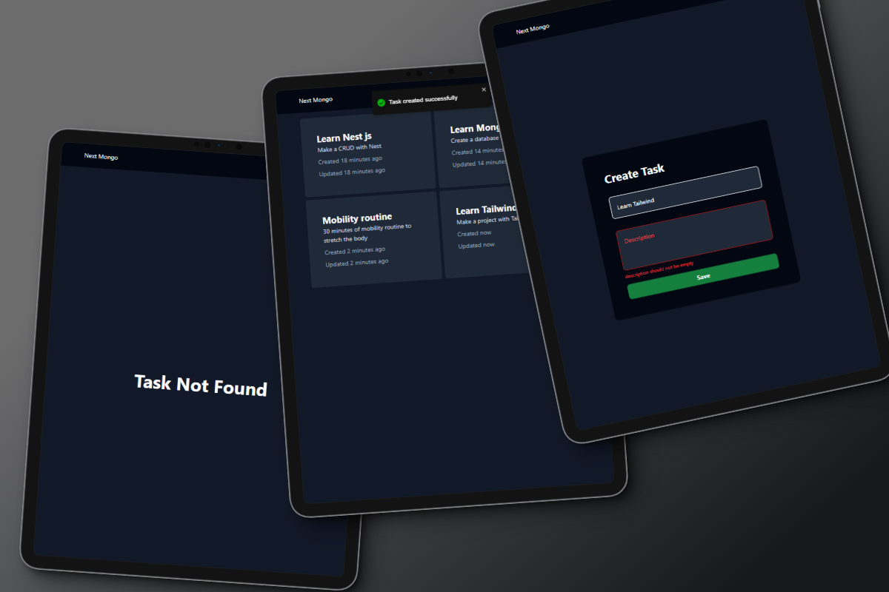

# Task App
Proyecto basado en el tutorial de [Fazt Code][FaztCode] para crear una aplicación de tareas con [Next.js][Next].

[![Tutorial fazt code NEXT MONGODB][YTImage]][YTVideo]

Es un [CRUD][WIKI-CRUD] sencillo donde se pueden crear, leer, actualizar y eliminar tareas.
Se almacenan en una base de datos ***NoSQL*** con [MongoDB][MongoDB] haciendo uso del ***ORM*** [Mongoose][Mongoose]

He cambiado la tecnología para dicha aplicación la cual usa [Nest][Nest] como backend, [Vite][Vite] como frontend y [Turbo][Turbo] para la creación del monorepositorio.
También se usan [Framer motion][FramerMotion] para animaciones, [SweetAlert2][SweetAlert2] para creación de pop-ups y [React Toastify][ReactToastify] para mostrar notificaciones

## Demo
> Importante: Al usar el servicio gratuito de [Render](https://render.com/) puede ser que al cargar la aplicación tarde un poco

[Task App Demo][App]

## Tecnologías usadas
  - [Vite][Vite]
  - [Framer motion][FramerMotion]
  - [SweetAlert2][SweetAlert2]
  - [React Toastify][ReactToastify]
  - [Typescript][Typescript]
  - [Tailwind][Tailwind]
  - [Nestjs][Nest]
  - [Mongoose][Mongoose]
  - [Turbo][Turbo]

## Screenshots
> Mockups generados con: [Shots.so][Shots.so]

[App]: https://tasks-fullstack.onrender.com/
[FaztCode]: https://www.youtube.com/@FaztCode
[FramerMotion]: https://www.framer.com/motion/
[MongoDB]: https://www.mongodb.com/es
[Mongoose]: https://mongoosejs.com/
[Next]: https://nextjs.org/
[Nest]: https://nestjs.com/
[ReactToastify]: https://github.com/fkhadra/react-toastify#readme
[Shots.so]: https://shots.so/
[SweetAlert2]: https://sweetalert2.github.io/
[Tailwind]: https://tailwindcss.com/
[Turbo]: https://turbo.build/
[Typescript]: https://www.typescriptlang.org/
[Vite]: https://vitejs.dev/
[WIKI-CRUD]: https://es.wikipedia.org/wiki/CRUD

[YTImage]: https://img.youtube.com/vi/CkiuF2wsPRg/0.jpg
[YTVideo]: https://www.youtube.com/watch?v=CkiuF2wsPRg
